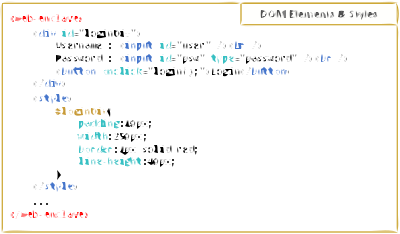
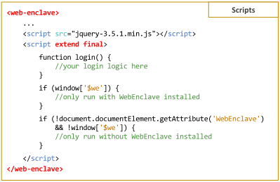

## What is WebEnclave?
- The first lightweight and universal solution that empowers the web application providers to restrict the full privileges of malicious extensions.
- The first comprehensive framework that grants users with the ability to adjust the required functionality and security guarantees of installed browser extensions subject to different web applications.

## Components

- **Client-side extension WebEnclave** 
WebEnclave runs as an extension installed in the browser of users.
When users visit secure web applications developed on top of WebEnclave, our proposed extension performs the initialization of the enclaves to isolate the sensitive web components inside.
Whenever the enclave is initialized, it provides strong isolation to protect sensitive web components from being either read or saved by any external part including web scripts and browser extensions.

- **Enclave initialized by the extension**
The enclave is the primitive of WebEnclave that allows web developers to isolate sensitive web components to be protected.
Concretely, it is a custom element defined by WebEnclave that can be used by the \texttt{<web-enclave>} tag.
To prevent the exposure of user data, developers should put all sensitive web components into the enclave to guarantee that users only sensitive private operations within the enclave.  

- **Server-side Middleware** 
As mentioned above, verifying the integrity of the enclave is needed.
To achieve the verification process, the server-side should take some operations which are required to modify the background code.
The middleware is designed to implement security primitives required for verification automatically.
Developers can directly deploy the middleware as a reverse proxy to enable WebEnclave without any modification of backend codes.

## Build Extension

The extension is published on Google Web Store : 

### Debug
Can directly load unpacked extension from the root.

### Release

Use gulp to generate the release versions to the folder: /dist

In addition, you are required to modify the "content_security_policy" in the manifest file of extension. Use the chrome devtools is good option: 
1. Load unpacked extension with the folder /dist.
2. Open a test page and see the console of Content Security Policy violation.
3. Follow the tips to add the checksum.

## Development: A Basic Example

In the following example, we build a form for users to login a system.
As shown in the demo, we can see two input elements respectively for collecting username and password, and a button element for clicking to login.
Also, the inline CSS style decorates the div element.

 

The above code looks like normal HTML, the only difference is the use of new tag <web-enclave>.
The basic usage of WebEnclave is to put sensitive HTML elements into the tag.
By default, the HTML elements within the enclave are dressed up by both the CSS styles inside and outside.

 

To add some logic to the login system, we put the script element into the enclave and write Javascript codes inside.
In the enclave, developers can import third-part libraries to accelerate the development, such as jquery in our example. 
The above code presents a skeleton of common scripts.
Developers are allowed to write separate codes for browsers that with and without WebEnclave installed.

Developers can use keywords to enable some useful features provided by WebEnclave.
The final keyword guarantees that the marked script will be executed after the execution of other scripts.
Moreover, the extend keyword extends the functionality of the marked script, using our implementation to overwrite some web APIs.
For example, developers can use the following two methods to move back one page:

    //with extend in <script>
    history.go(-1);

    //without extend in <script>
    $we.env.history.go(-1);
    
We can see that with the extend, developers can execute web APIs in the host page by calling corresponding functions in the enclave.

## Deployment

To enable our security features, developers are recommended to use our proposed middleware on the server-side.
In this project, the WebEnclaveProxy is the root of the middleware.
The middleware runs like a reverse proxy service that retrieves resources on behalf of a client and automatically adds security support to requests.
Developers can use the following command to start the middleware:

    node m.js --src=A --port=80 --des=B --out=8080

In the above example, the middleware provides secure web service in server A on port 80, and the original web server is deployed in server B on port 8080.

## Test

We list all the test pages mentioned the our paper in the folder /Test.
All the evaulation are reproducible.
